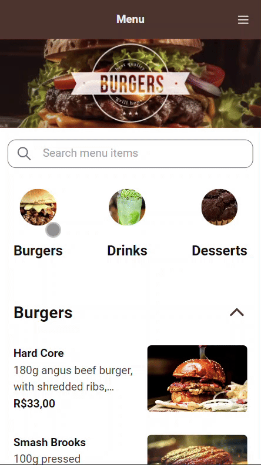

# Qikserve Menu

<p align="center">
    
</p>

<p align="center">
    
    
    
</p>

# Como executar o projeto

### 1. Instale o Node.js
Antes de começar, certifique-se de que o **Node.js** está instalado. Você pode baixar e instalar o Node.js [aqui](https://nodejs.org).

Para verificar a instalação, execute o seguinte comando no terminal:

```bash
node -v
npm -v
```
### 2. Clone o repositório

Use o comando `git` abaixo para clonar o repositório do projeto para sua máquina local:

```bash
git clone git@github.com:inaciorafael/qikserve-menu.git
```

### 3. Instale as dependências e inicie o projeto

```bash
npm install
npm run dev
```

## Tecnologias usadas

- **`@reduxjs/toolkit`**: Facilita o gerenciamento de estado global no React, permitindo que você armazene e compartilhe dados entre vários componentes da aplicação.

- **`@tanstack/react-query`**: Gerencia dados assíncronos, como respostas de APIs, cuidando do cache e da sincronização de forma automática, para manter os dados sempre atualizados.

- **`axios`**: Biblioteca para fazer requisições HTTP, permitindo que você busque ou envie dados para uma API através de métodos como `GET` e `POST`.

- **`react-hook-form`**: Simplifica o controle de formulários no React, facilitando a manipulação de dados e validação dos inputs.

- **`react-redux`**: É a biblioteca oficial de integração entre o React e o Redux. Ela permite que os componentes React acessem o estado global gerenciado pelo Redux e despachem ações para modificar esse estado.
